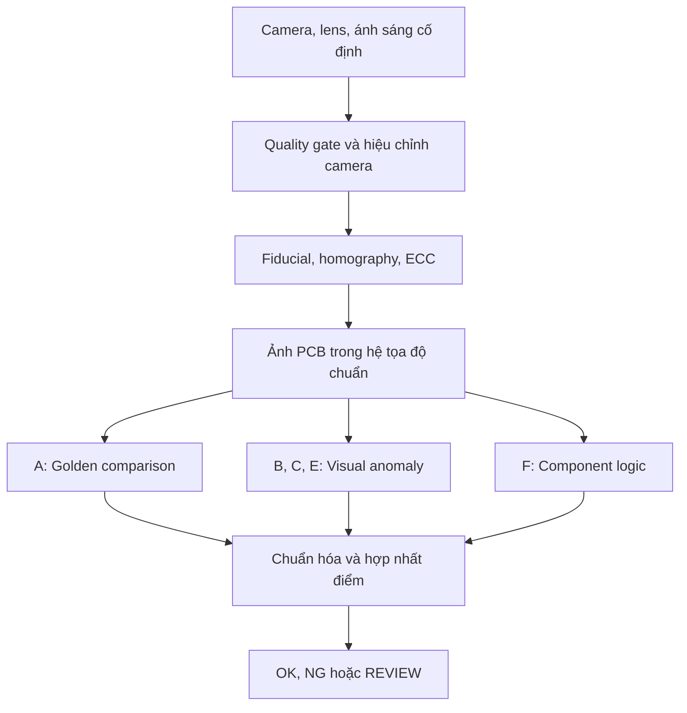
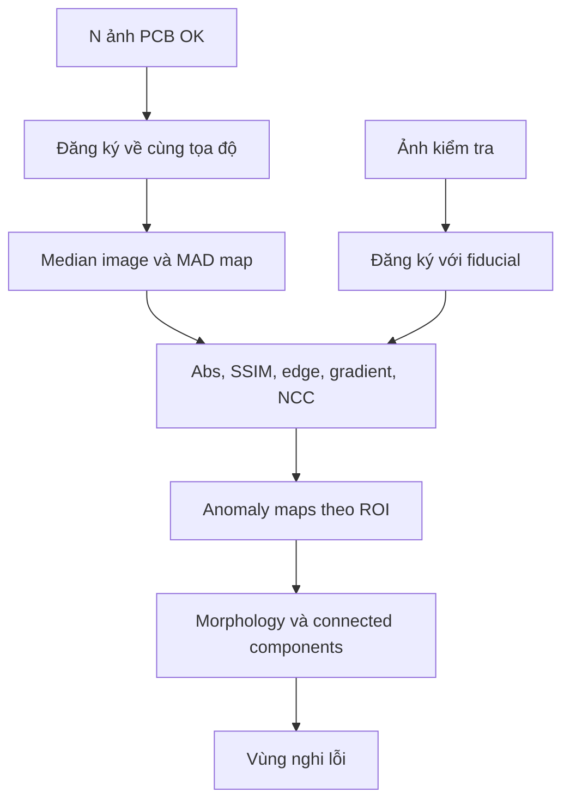
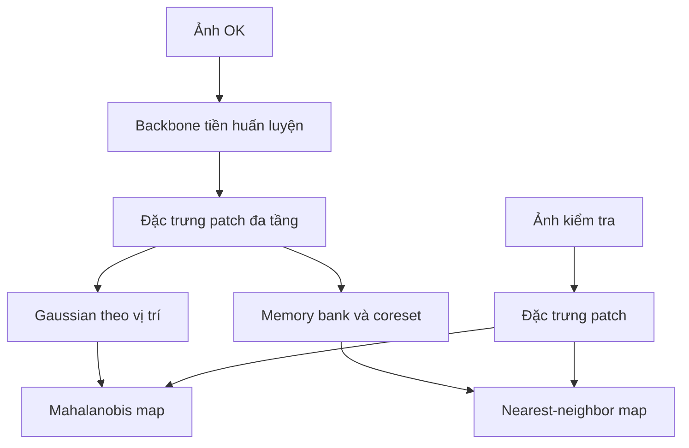
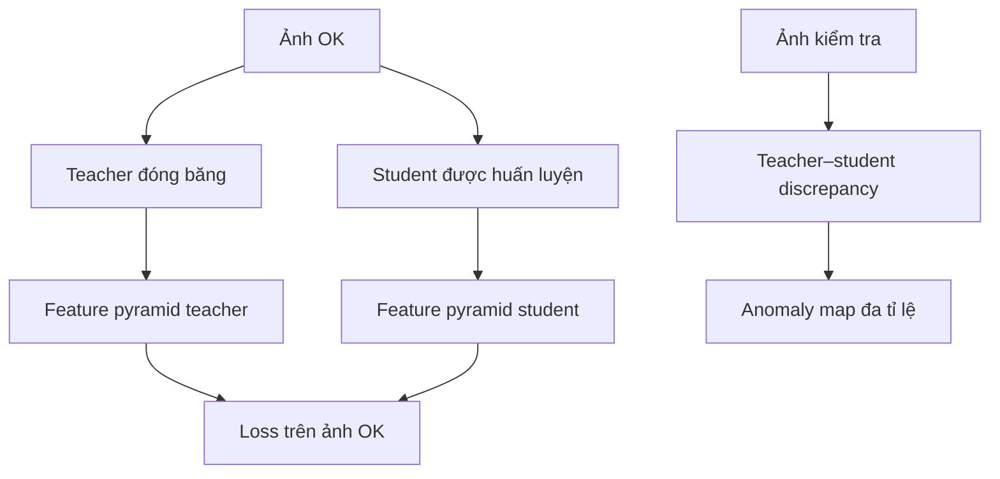
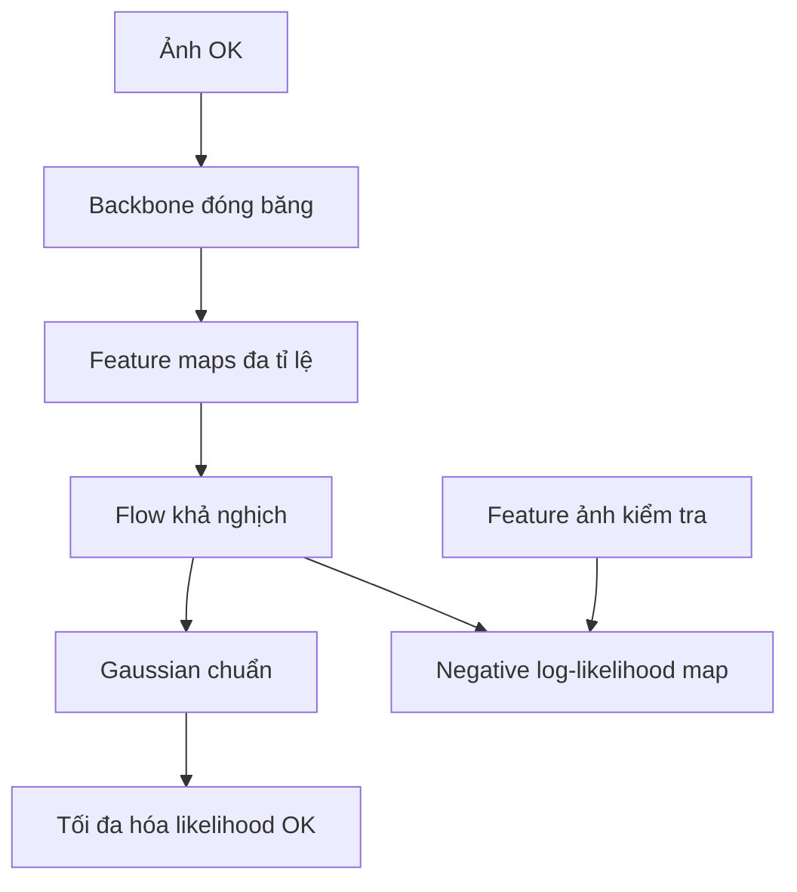
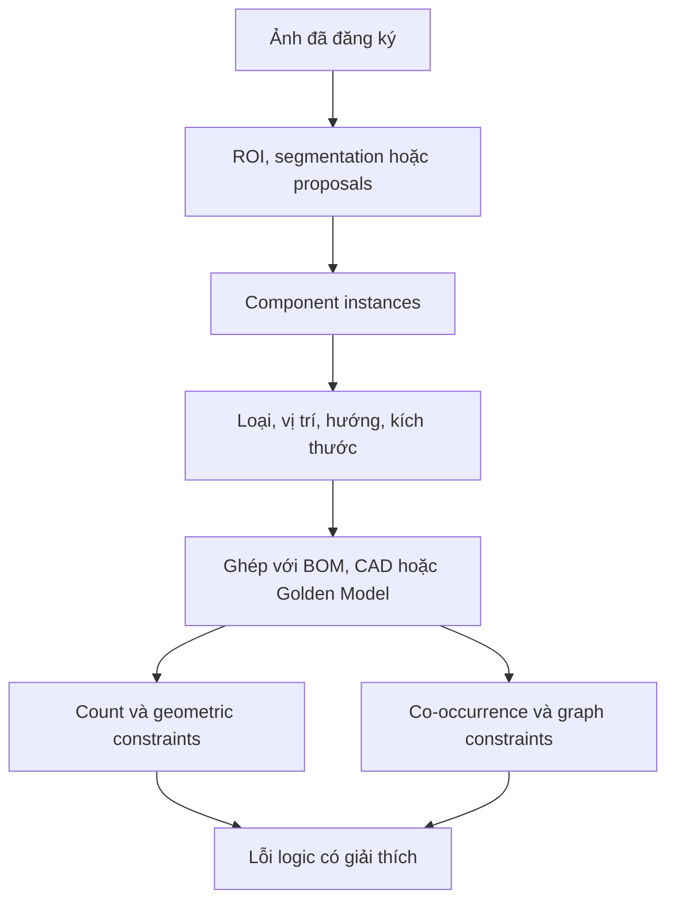
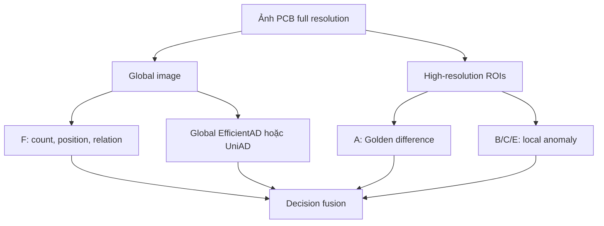

# Báo cáo chuyên sâu: AOI 2D cho PCB chỉ học từ mẫu tốt

## Phạm vi và kết luận định hướng

Báo cáo này tập trung vào hệ thống AOI dùng **một camera 2D**, học từ PCB đạt chuẩn và không cần gán nhãn từng loại lỗi trong pha huấn luyện. Năm nhóm được phân tích là:

- **Nhóm A — So sánh trực tiếp với Golden PCB:** đo sai khác giữa ảnh kiểm tra và ảnh hoặc mô hình tham chiếu.
- **Nhóm B — Mô hình hóa phân bố đặc trưng:** mô tả các patch bình thường bằng Gaussian hoặc ngân hàng đặc trưng rồi tìm ngoại lai.
- **Nhóm C — Student–Teacher và Knowledge Distillation:** sinh viên học bắt chước giáo viên trên ảnh tốt; sai khác khi kiểm tra là tín hiệu dị thường.
- **Nhóm E — Normalizing Flow:** học mật độ xác suất của đặc trưng bình thường bằng phép biến đổi khả nghịch.
- **Nhóm F — Lỗi logic và nhận biết linh kiện:** kiểm tra số lượng, loại, vị trí, hướng và quan hệ giữa các linh kiện.

Kết luận thực dụng cho dự án PCB có ít dữ liệu là:

1. Bắt đầu bằng **đăng ký ảnh chính xác + Golden Model nhiều ảnh OK + Nhóm A**. Đây là baseline dễ giải thích và giúp kiểm tra chất lượng cơ khí–quang học của trạm chụp.
2. Thêm **PatchCore hoặc AnomalyDINO thuộc Nhóm B** để bắt các biến đổi mà sai khác pixel không mô tả tốt.
3. Xây **Nhóm F như một tầng riêng** cho missing component, sai vị trí, sai hướng, sai số lượng và sai quan hệ. Không nên kỳ vọng một bản đồ dị thường cục bộ tự suy ra đầy đủ các lỗi logic.
4. Thử **EfficientAD thuộc Nhóm C** nếu yêu cầu tốc độ cao và cần thêm nhánh nhìn toàn cục.
5. Chỉ ưu tiên **Normalizing Flow thuộc Nhóm E** sau khi pipeline dữ liệu ổn định và số ảnh OK đủ bao phủ biến thiên sản xuất; đây không phải lựa chọn đầu tiên cho một tập rất nhỏ.

> **Giới hạn vật lý:** một ảnh RGB từ một góc chỉ phát hiện được lỗi làm thay đổi tín hiệu quang học nhìn thấy. Hệ thống không thể bảo đảm phát hiện mối hàn ẩn dưới BGA, đứt mạch bên trong, giá trị điện sai nhưng ngoại hình giống nhau, hoặc lỗi nằm ở mặt khuất. “Lỗi chưa biết” trong báo cáo có nghĩa là **sai khác thị giác chưa được gán lớp**, không phải mọi lỗi vật lý hoặc điện tử có thể tồn tại.

---

## 1. Các khái niệm cần phân biệt

### 1.1 Golden PCB, Golden Image và Golden Model

- **Golden PCB:** bo mạch vật lý đã được xác nhận đạt chuẩn.
- **Golden Image:** một ảnh chuẩn chụp từ Golden PCB dưới cấu hình camera–ánh sáng xác định.
- **Golden Model:** mô hình thống kê hoặc mô hình đặc trưng xây từ nhiều ảnh/bo OK, ví dụ median–MAD, Gaussian của PaDiM hoặc memory bank của PatchCore.

Absolute difference, SSIM, NCC, XOR và template matching **không phải là Golden PCB**. Chúng là các phép đo hoặc thuật toán dùng để so sánh ảnh kiểm tra với Golden Image/Golden Model. Vì vậy có thể nói “AOI dựa trên Golden PCB sử dụng SSIM”, nhưng không nên nói “SSIM là Golden PCB”.

### 1.2 “Unsupervised” trong AOI công nghiệp

Trong nhiều bài báo, “unsupervised anomaly detection” thực tế là bài toán **one-class learning**:

- Pha học chỉ chứa ảnh đạt chuẩn.
- Không cần mask lỗi hoặc nhãn loại lỗi để tối ưu mô hình.
- Khi suy luận, mô hình trả về anomaly score và thường có anomaly map.

Tuy vậy, để đo recall, escape rate và chọn ngưỡng có trách nhiệm, vẫn cần một tập kiểm thử có lỗi thật hoặc lỗi được kiểm chứng. Không dùng nhãn để **học** không có nghĩa là không cần dữ liệu lỗi để **đánh giá**.

Cũng cần phân biệt ba nguồn tri thức:

| Nguồn | Có vi phạm mục tiêu “không gán nhãn lỗi” không? | Ví dụ |
|---|---:|---|
| Ảnh PCB OK của nhà máy | không | median/MAD, memory bank, train student/flow |
| Backbone tiền huấn luyện bên ngoài | không, nhưng không phải học hoàn toàn từ đầu bằng dữ liệu nội bộ | ImageNet CNN, DINOv2 |
| Đặc tả kỹ thuật không phải nhãn lỗi | không | BOM, CAD, centroid, ROI, polarity rule |

PatchCore, PaDiM, STFPM và các flow thường dựa vào backbone đã tiền huấn luyện. EfficientAD còn có penalty dùng ảnh tự nhiên trong thiết lập của paper. Chúng không cần ảnh lỗi PCB để huấn luyện, nhưng cũng không phải hệ thống hoàn toàn không sử dụng tri thức bên ngoài.

### 1.3 Lỗi cấu trúc và lỗi logic

| Loại | Bản chất | Ví dụ PCB | Nhóm mạnh nhất |
|---|---|---|---|
| Structural anomaly | Một vùng có hình dạng hoặc kết cấu lạ | xước, thừa thiếc, cầu hàn, lộ đồng | A, B, C, E |
| Logical anomaly | Các thành phần riêng lẻ có vẻ bình thường nhưng tổ hợp sai | thiếu linh kiện, sai vị trí, sai hướng, sai loại, sai số lượng | F; nhánh global của C hỗ trợ |
| Hidden/electrical defect | Không tạo dấu hiệu quang học quan sát được | lỗi điện bên trong, mối hàn dưới BGA | Không giải được chắc chắn bằng một ảnh 2D |

MVTec LOCO AD được tạo riêng để đánh giá cả lỗi cấu trúc và logic; lỗi logic của benchmark gồm các trường hợp vật thể hợp lệ ở vị trí không hợp lệ hoặc vật thể bắt buộc bị thiếu ([MVTec LOCO AD](https://www.mvtec.com/research-teaching/datasets/mvtec-loco-ad)).

> **Lưu ý giấy phép:** trang chính thức của MVTec LOCO AD công bố dữ liệu theo CC BY-NC-SA 4.0 và nêu rõ không dùng cho mục đích thương mại. Có thể dùng để nghiên cứu/benchmark theo điều khoản, nhưng không nên tự động đưa ảnh hoặc tài nguyên của bộ dữ liệu vào sản phẩm thương mại.

---

## 2. Kiến trúc AOI 2D tổng thể



Ba tầng không nên bị trộn lẫn:

1. **Ổn định phép đo:** camera, ánh sáng, hiệu chỉnh méo, đăng ký ảnh.
2. **Sinh bằng chứng:** anomaly map từ A/B/C/E và lỗi linh kiện từ F.
3. **Ra quyết định:** chuẩn hóa score, hợp nhất, ngưỡng và chính sách OK/NG/REVIEW.

Nếu tầng 1 sai một đến hai pixel, tầng 2 có thể tạo một đường viền giả quanh mọi pad và linh kiện. Khi đó thay mô hình học sâu thường không chữa được gốc vấn đề.

---

## 3. Tiền xử lý bắt buộc trước mọi nhóm thuật toán

### 3.1 Chuẩn hóa trạm chụp

Cần khóa hoặc giám sát:

- khoảng cách camera–PCB, tiêu cự, focus và khẩu độ;
- exposure, gain, white balance và gamma;
- vị trí, góc và cường độ đèn;
- loại khay, nền, cơ cấu giữ bo;
- mã phiên bản PCB, mặt top/bottom và công đoạn sản xuất.

Nên chụp RAW hoặc ảnh ít nén nếu cần thấy scratch/cầu hàn rất nhỏ. Mỗi ảnh cần kèm metadata của recipe để phân biệt lỗi sản phẩm với lỗi trạm chụp.

### 3.2 Hiệu chỉnh méo và đăng ký ảnh

Với điểm ảnh đồng nhất \(\mathbf{x}=[u,v,1]^T\), phép biến đổi phẳng được mô tả bởi homography:

\[
\mathbf{x}_{g} \sim \mathbf{H}\mathbf{x}_{t}, \qquad \mathbf{H}\in\mathbb{R}^{3\times3}.
\]

Trong đó \(t\) là ảnh kiểm tra và \(g\) là hệ tọa độ golden. Pipeline thực tế:

1. phát hiện ít nhất 3–4 fiducial ổn định;
2. ước lượng affine/homography bằng RANSAC;
3. warp ảnh kiểm tra về hệ tọa độ chuẩn;
4. tinh chỉnh cục bộ bằng ECC hoặc optical alignment trong từng vùng;
5. loại ảnh nếu residual của fiducial vượt giới hạn.

ECC tối ưu tương quan giữa ảnh chuẩn và ảnh đã warp:

\[
\mathbf{W}^{*}=\arg\max_{\mathbf{W}}\rho\bigl(G,\,I\circ\mathbf{W}\bigr).
\]

OpenCV cung cấp `findTransformECC`; tài liệu và ví dụ đăng ký ảnh có tại [OpenCV image alignment sample](https://docs.opencv.org/4.0.1/dd/d93/samples_2cpp_2image_alignment_8cpp-example.html).

### 3.3 Mask và ROI

Không nên chấm điểm toàn ảnh một cách đồng nhất. Hãy tạo:

- board mask để bỏ nền và gá kẹp;
- keep-out mask cho vùng phản xạ không ổn định hoặc mã in thay đổi hợp lệ;
- ROI theo linh kiện/pad/đường mạch;
- ignore mask cho biên ảnh sau warp;
- vùng đánh trọng số cao cho pitch nhỏ, chân IC và cầu hàn nguy hiểm.

### 3.4 Chia tập dữ liệu đúng

Nếu một bo được chụp nhiều lần, mọi lần chụp của bo đó phải nằm cùng một split. Nếu không, mô hình có thể ghi nhớ vết riêng của bo thay vì học trạng thái bình thường.

Một cấu trúc tối thiểu:

```text
train/good/          # Chỉ bo OK, dùng học mô hình
val/good/            # Chọn ngưỡng false-call mà không cần nhãn lỗi
test/good/           # Đo false positive
test/anomaly/...     # Chỉ dùng đánh giá, không đưa vào huấn luyện
masks/...            # Có thì dùng đo localization; không bắt buộc để học
```

Với vài chục ảnh OK, không nên huấn luyện CNN từ đầu. Các lựa chọn hợp lý là golden statistics, pretrained feature + nearest neighbor, hoặc distillation từ backbone đã tiền huấn luyện.

---

## 4. Nhóm A — So sánh trực tiếp với Golden PCB

### 4.1 Bản chất

Sau đăng ký ảnh, mỗi vị trí trên ảnh kiểm tra được giả định tương ứng cùng một vị trí vật lý trên golden. Thuật toán đo sai khác ở pixel, cửa sổ hoặc ROI.

Hệ thống [ChangeChip](https://github.com/scientific-computing-lab-nrcn/changechip) là ví dụ PCB trực tiếp: so sánh ảnh bo cần kiểm tra với golden PCB bằng xử lý ảnh, computer vision và học không giám sát; bài báo mô tả phát hiện từ lỗi hàn đến linh kiện thiếu/sai vị trí ([ChangeChip paper](https://arxiv.org/abs/2109.05746)).



### 4.2 Absolute Difference

Với ảnh \(C\) kênh:

\[
D_{\text{abs}}(p)=\frac{1}{C}\sum_{c=1}^{C}\left|I_c(p)-G_c(p)\right|.
\]

Ví dụ pixel ở solder mask chuẩn có RGB \((30,120,70)\), ảnh kiểm tra là \((35,165,82)\):

\[
D_{\text{abs}}=\frac{|35-30|+|165-120|+|82-70|}{3}=20.67.
\]

**Cách dùng:** làm mượt nhẹ để giảm shot noise, tính sai khác trong Lab hoặc HSV, threshold rồi morphology. Lab thường dễ tách thay đổi sáng \(L\) khỏi đổi màu \(a,b\).

**Mạnh:** rất nhanh; dễ giải thích; tốt với missing component, vết xước có tương phản và vùng thiếc thay đổi rõ.

**Yếu:** cực nhạy với lệch hình học, bóng gương của thiếc, exposure và white balance. Một Golden Image đơn thường tạo false positive lớn hơn Golden Model nhiều ảnh.

### 4.3 Median và MAD từ nhiều ảnh OK

Đây là cách xây **Golden Model thống kê**, không chỉ là phép so sánh.

Với \(N\) ảnh OK đã đăng ký:

\[
m_c(p)=\operatorname{median}_{i=1..N} I_{i,c}(p),
\]

\[
\operatorname{MAD}_c(p)=\operatorname{median}_{i=1..N}\left|I_{i,c}(p)-m_c(p)\right|.
\]

Điểm robust z-score:

\[
Z_c(p)=\frac{|I_c(p)-m_c(p)|}
{1.4826\operatorname{MAD}_c(p)+\epsilon}.
\]

Hệ số 1.4826 đưa MAD về xấp xỉ độ lệch chuẩn nếu nhiễu Gaussian. Có thể hợp nhất kênh bằng \(Z(p)=\max_c Z_c(p)\) hoặc trung bình top-2 kênh.

**Trực giác:** vùng thiếc vốn dao động mạnh qua các bo sẽ có MAD lớn và bị giảm độ nhạy; vùng đường mạch ổn định có MAD nhỏ nên một thay đổi nhỏ vẫn nổi bật.

**Cảnh báo:** nếu tập OK bị lẫn bo lỗi lặp lại ở hơn một nửa số ảnh tại cùng vị trí, median có thể xem lỗi đó là chuẩn. Vì vậy dữ liệu OK cần qua quality gate.

### 4.4 SSIM — Structural Similarity

Trong một cửa sổ \(x,y\), SSIM là:

\[
\operatorname{SSIM}(x,y)=
\frac{(2\mu_x\mu_y+C_1)(2\sigma_{xy}+C_2)}
{(\mu_x^2+\mu_y^2+C_1)(\sigma_x^2+\sigma_y^2+C_2)}.
\]

Trong đó \(\mu\) là trung bình, \(\sigma^2\) là phương sai và \(\sigma_{xy}\) là hiệp phương sai cục bộ. Bản đồ dị thường có thể đặt:

\[
A_{\text{SSIM}}(p)=\frac{1-\operatorname{SSIM}(p)}{2}.
\]

SSIM được thiết kế để đo thay đổi độ sáng, tương phản và cấu trúc thay vì chỉ lỗi pixel ([Wang et al., 2004](https://www.cns.nyu.edu/pub/lcv/wang03-reprint.pdf)).

**Khi hữu ích:** vùng silk screen, thân linh kiện, pad hoặc texture có thay đổi cấu trúc nhưng độ sáng chung dao động nhẹ.

**Tham số quan trọng:** cửa sổ nhỏ thấy lỗi nhỏ nhưng nhạy nhiễu; cửa sổ lớn ổn định hơn nhưng làm loãng scratch/cầu hàn mảnh. Với ảnh PCB độ phân giải cao nên chạy nhiều kích thước cửa sổ hoặc theo ROI.

**Không nên hiểu sai:** SSIM không tự sửa lệch ảnh. Một dịch chuyển một pixel ở cạnh sắc vẫn gây một dải anomaly lớn.

### 4.5 Normalized Cross-Correlation — NCC

Với hai ROI cùng kích thước:

\[
\rho(I,G)=
\frac{\sum_p(I(p)-\bar I)(G(p)-\bar G)}
{\sqrt{\sum_p(I(p)-\bar I)^2}\sqrt{\sum_p(G(p)-\bar G)^2}+\epsilon}.
\]

Điểm dị thường có thể là \(A_{\text{NCC}}=(1-\rho)/2\). Việc trừ trung bình và chuẩn hóa năng lượng làm NCC bền hơn absolute difference trước một số thay đổi độ sáng tuyến tính.

**Hai cách dùng khác nhau:**

- NCC toàn ROI trả về một score cho linh kiện/vùng.
- Local NCC với cửa sổ trượt tạo anomaly map.

NCC cũng là một metric thường dùng bên trong template matching. Nó không đồng nghĩa với toàn bộ quy trình template matching.

### 4.6 Edge Difference

Tạo edge map \(E_I,E_G\) bằng Canny hoặc threshold độ lớn Sobel, sau đó:

\[
D_{\text{edge}}(p)=E_I(p)\oplus E_G(p).
\]

Edge difference bỏ qua phần lớn thay đổi màu/độ sáng trong vùng phẳng và tập trung vào biên hình học. Nó phù hợp với:

- mất hoặc lệch linh kiện;
- hình dạng chân/pad thay đổi;
- đường mạch đứt hoặc thừa;
- biên vết xước.

**Nâng cấp chống lệch nhỏ:** thay XOR đúng pixel bằng khoảng cách Chamfer. Tính distance transform \(d_G\) của edge golden và phạt mỗi edge kiểm tra theo khoảng cách tới edge gần nhất:

\[
D_{\text{chamfer}}=\frac{1}{|E_I|}\sum_{p:E_I(p)=1}d_G(p).
\]

Nên tính hai chiều để phát hiện cả edge thừa và edge thiếu.

### 4.7 Gradient Difference

Với Sobel:

\[
\nabla I(p)=[g_x^I(p),g_y^I(p)]^T,
\qquad
D_{\nabla}(p)=\|\nabla I(p)-\nabla G(p)\|_2.
\]

Có thể tách độ lớn \(M=\sqrt{g_x^2+g_y^2}\) và hướng \(\theta=\operatorname{atan2}(g_y,g_x)\):

\[
D_{\theta}(p)=1-\cos(\theta_I(p)-\theta_G(p)).
\]

Để tránh hướng gradient vô nghĩa trong vùng phẳng, nhân \(D_\theta\) với \(\min(M_I,M_G)\). Gradient giữ nhiều thông tin hơn binary edge và thường tốt cho scratch mảnh, biến dạng chân linh kiện và biên cầu hàn.

### 4.8 XOR sau nhị phân hóa

Sau khi tách đối tượng/đồng/pad thành mask \(B_I,B_G\):

\[
D_{\text{xor}}(p)=B_I(p)\oplus B_G(p).
\]

Ví dụ, nếu golden có pad tại một pixel \(B_G=1\) nhưng ảnh kiểm tra không có \(B_I=0\), XOR bằng 1.

**Mạnh:** rất nhanh, dễ quy đổi thành diện tích lỗi; tốt khi đối tượng có thể phân đoạn chắc bằng màu hoặc illumination truyền qua.

**Yếu:** threshold màu không ổn định và lệch một pixel tạo hai đường viền XOR. Cần đăng ký tốt, morphology, vùng dung sai và threshold riêng theo loại ROI.

### 4.9 Template Matching

Cho template \(T\) của một linh kiện và vùng tìm kiếm \(R\), thuật toán trượt \(T\) qua các vị trí \(q\) và tìm:

\[
q^*=\arg\max_q\operatorname{NCC}(T,R_q)
\]

hoặc

\[
q^*=\arg\min_q\sum_p(T(p)-R_q(p))^2.
\]

OpenCV cung cấp sáu chế độ `matchTemplate`, gồm squared difference và các dạng correlation chuẩn hóa ([OpenCV Template Matching](https://docs.opencv.org/4.13.0/d4/dc6/tutorial_py_template_matching.html)).

Từ kết quả có thể suy ra:

- **missing:** score tốt nhất thấp hơn ngưỡng;
- **misaligned:** \(\Delta x,\Delta y\) vượt dung sai;
- **rotated/reversed:** template ở góc khác thắng;
- **wrong component:** template của loại khác có score cao hơn.

Nên lưu nhiều template OK cho biến thiên hợp lệ của chữ in, nhà cung cấp hoặc phản xạ. Template matching cơ bản không tự bền với thay đổi scale, rotation và perspective.

### 4.10 Mahalanobis distance theo từng pixel

Tại pixel/patch \(p\), biểu diễn quan sát bằng vector:

\[
\mathbf{x}(p)=[L,a,b,|\nabla I|,\ldots]^T.
\]

Từ ảnh OK ước lượng trung bình \(\boldsymbol\mu_p\) và covariance \(\boldsymbol\Sigma_p\). Điểm:

\[
D_M(p)=\sqrt{(\mathbf{x}(p)-\boldsymbol\mu_p)^T
(\boldsymbol\Sigma_p+\lambda\mathbf{I})^{-1}
(\mathbf{x}(p)-\boldsymbol\mu_p)}.
\]

Khác Euclidean distance, Mahalanobis tính đến phương sai và tương quan giữa các kênh. Ví dụ độ sáng \(L\) và độ bóng cùng tăng bình thường sẽ ít bị phạt hơn một đổi màu \(a,b\) hiếm.

**Điều kiện số:** nếu số ảnh OK nhỏ hơn chiều vector, covariance suy biến. Cần giảm chiều, dùng covariance đường chéo hoặc shrinkage \(\lambda\mathbf I\). PaDiM ở Nhóm B chính là mở rộng ý tưởng này sang đặc trưng CNN đa tầng.

### 4.11 Hợp nhất các phép đo Nhóm A

Không cộng trực tiếp raw score vì mỗi metric có thang khác nhau. Với metric \(j\), xây empirical CDF trên validation OK:

\[
Q_j(s)=\widehat F_{j,\mathrm{OK}}(s).
\]

Khi đó \(Q_j\) gần khoảng \([0,1]\), và có thể hợp nhất:

\[
A_{\text{fuse}}(p)=\max_j Q_j(A_j(p))
\]

hoặc weighted sum nếu đã hiệu chỉnh trọng số. `max` ưu tiên recall nhưng dễ false call; trung bình top-k metric thường ổn định hơn.

#### Lựa chọn nhanh trong Nhóm A

| Thuật toán | Bắt tốt | Chịu đổi sáng | Nhạy lệch ảnh | Chi phí | Khuyến nghị PCB |
|---|---|---:|---:|---:|---|
| Absolute difference | đổi màu, mất/thừa vùng | thấp | rất cao | rất thấp | luôn làm baseline |
| Median + MAD | sai khác vượt biến thiên OK | khá | cao | thấp | golden mặc định |
| SSIM | đổi cấu trúc cục bộ | khá | cao | thấp–vừa | kết hợp abs |
| NCC | hình dạng/texture ROI | khá–tốt | vừa–cao | thấp | ROI linh kiện |
| Edge difference | biên thiếu/thừa | tốt | cao | thấp | pad, chân, outline |
| Gradient difference | scratch, biên tinh | khá | cao | thấp | lỗi mảnh |
| Binary XOR | mask thiếu/thừa | tùy segmentation | cực cao | rất thấp | trace/pad có mask tốt |
| Template matching | hiện diện/vị trí/hướng | khá với NCC | vừa | thấp–vừa | linh kiện cố định |
| Pixel Mahalanobis | sai khác đa kênh | tốt nếu học đủ | cao | vừa | nhiều ảnh OK đã align |

---

## 5. Nhóm B — Mô hình hóa phân bố đặc trưng

### 5.1 Ý tưởng chung

Thay vì so RGB, dùng backbone đã tiền huấn luyện để biến patch ảnh thành vector \(\mathbf{f}_p\). Học tập hợp hoặc phân bố của các vector từ ảnh OK. Patch kiểm tra xa phân bố bình thường sẽ có score cao.



Đặc trưng thường bền với thay đổi ánh sáng nhỏ hơn raw pixel, nhưng việc resize ảnh xuống kích thước nhỏ có thể làm mất bridge/scratch vài pixel. PCB độ phân giải cao nên chia tile có overlap hoặc crop ROI theo linh kiện.

### 5.2 SPADE — Semantic Pyramid Anomaly Detection

SPADE là tiền thân quan trọng của nhóm nearest neighbor:

1. trích xuất embedding toàn ảnh kiểm tra;
2. tìm \(K\) ảnh OK gần nhất;
3. ở nhiều tầng CNN, tìm correspondence gần nhất giữa patch kiểm tra và patch của các ảnh OK đã chọn;
4. nội suy khoảng cách patch thành anomaly map.

Với patch \(p\):

\[
A(p)=\min_{k\in\mathcal N_K(I)}\min_q
\|\mathbf f_p(I)-\mathbf f_q(G_k)\|_2.
\]

SPADE gần như không có pha huấn luyện chuyên biệt và dùng feature pyramid để định vị anomaly ([paper](https://arxiv.org/abs/2005.02357), [PyTorch repository](https://github.com/byungjae89/spade-pytorch)).

**PCB:** hữu ích khi có nhiều golden variant và ảnh chưa căn tuyệt đối, nhưng tìm kiếm hai cấp tốn bộ nhớ/thời gian hơn các phương pháp coreset hiện đại.

### 5.3 PaDiM — Patch Distribution Modeling

PaDiM lấy đặc trưng từ nhiều tầng CNN, resize về cùng lưới rồi nối kênh. Tại mỗi vị trí lưới \(p\), các ảnh OK tạo một Gaussian riêng:

\[
\mathbf f_p\sim\mathcal N(\boldsymbol\mu_p,\boldsymbol\Sigma_p).
\]

Anomaly score là Mahalanobis:

\[
A_{\text{PaDiM}}(p)=
\sqrt{(\mathbf f_p-\boldsymbol\mu_p)^T
(\boldsymbol\Sigma_p+\lambda\mathbf I)^{-1}
(\mathbf f_p-\boldsymbol\mu_p)}.
\]

PaDiM dùng CNN tiền huấn luyện, Gaussian đa biến theo patch và tương quan giữa nhiều mức đặc trưng ([PaDiM paper](https://arxiv.org/abs/2011.08785)).

**Vì sao hợp PCB:** sau fiducial alignment, vị trí \(p\) có ý nghĩa cố định: patch tại U1 chỉ được so với phân bố U1, không bị một linh kiện giống ở vùng khác “giải thích hộ”.

**Điểm yếu:** rất nhạy registration; phải lưu inverse covariance cho nhiều vị trí; số ảnh ít làm covariance kém ổn định. PaDiM thường chọn ngẫu nhiên một phần chiều đặc trưng để giảm chi phí và tránh suy biến.

### 5.4 PatchCore

PatchCore không ép mỗi vị trí vào một Gaussian. Nó lưu các patch feature bình thường vào memory bank \(\mathcal M\):

\[
A_{\text{patch}}(p)=\min_{\mathbf m\in\mathcal M}
\|\mathbf f_p-\mathbf m\|_2.
\]

Nếu giữ mọi patch, bộ nhớ phình rất nhanh. PatchCore chọn coreset đại diện bằng bài toán k-center gần đúng:

\[
\mathcal C^*=\arg\min_{|\mathcal C|=m}
\max_{\mathbf m\in\mathcal M}
\min_{\mathbf c\in\mathcal C}\|\mathbf m-\mathbf c\|_2.
\]

Trực giác: mỗi lần chọn patch xa nhất với tập đã chọn để phủ không gian bình thường. Paper gọi đây là “maximally representative memory bank” ([CVPR paper](https://openaccess.thecvf.com/content/CVPR2022/papers/Roth_Towards_Total_Recall_in_Industrial_Anomaly_Detection_CVPR_2022_paper.pdf), [official repository](https://github.com/amazon-science/patchcore-inspection)). Anomalib có implementation và k-center-greedy sẵn ([PatchCore documentation](https://anomalib.readthedocs.io/en/v2.0.0/markdown/guides/reference/models/image/patchcore.html)).

**PCB:** đây là baseline học đặc trưng ưu tiên nhất khi số ảnh OK nhỏ. Nó không huấn luyện backbone, hỗ trợ localization và coreset kiểm soát bộ nhớ.

**Rủi ro:** vì patch có thể match với patch ở vị trí khác, linh kiện thiếu hoặc sai vị trí đôi khi bị một patch bình thường tương tự ở nơi khác làm giảm score. Có thể khắc phục bằng:

- thêm tọa độ chuẩn hóa vào vector feature;
- memory bank riêng theo ROI/loại linh kiện;
- giới hạn nearest neighbor trong vùng vị trí lân cận;
- kết hợp Nhóm F.

### 5.5 AnomalyDINO

AnomalyDINO thay CNN patch descriptor bằng đặc trưng DINOv2 và giữ mô hình theo hướng patch-level nearest neighbor, không cần fine-tuning hoặc meta-learning ([paper](https://arxiv.org/abs/2405.14529), [official repository](https://github.com/dammsi/AnomalyDINO)). Với cosine distance:

\[
A(p)=1-\max_{\mathbf r\in\mathcal R}
\frac{\mathbf f_p^T\mathbf r}{\|\mathbf f_p\|_2\|\mathbf r\|_2}.
\]

**Mạnh:** few-shot tốt, thiết lập nhanh, đặc trưng transformer giàu ngữ nghĩa hơn CNN truyền thống.

**Yếu cho PCB:** patch size và input resize có thể bỏ qua lỗi rất nhỏ; foundation feature có thể xem hai màu/texture công nghiệp khác nhau là cùng ngữ nghĩa. Cần test ở độ phân giải thực và không suy ra hiệu quả PCB chỉ từ benchmark vật thể thông thường.

### 5.6 So sánh trong Nhóm B

| Phương pháp | Mô hình bình thường | Có huấn luyện task-specific? | Position-aware | Bộ nhớ | Điểm đáng chú ý |
|---|---|---:|---:|---:|---|
| SPADE | kNN ảnh và patch | không | tương đối | cao | dễ hiểu, inference nặng |
| PaDiM | Gaussian tại mỗi vị trí | không huấn luyện backbone | rất cao | vừa–cao | hợp PCB align tốt |
| PatchCore | coreset của patch feature | không | thấp nếu không sửa | điều chỉnh được | lựa chọn đầu tiên |
| AnomalyDINO | DINOv2 reference patches | không | tùy cấu hình | vừa–cao | few-shot mạnh, cần giữ độ phân giải |

---

## 6. Nhóm C — Student–Teacher và Knowledge Distillation

### 6.1 Cơ chế chung

Teacher \(T\) đã tiền huấn luyện và được đóng băng. Student \(S_\theta\) chỉ nhìn ảnh OK và học tái tạo/bắt chước feature của teacher:

\[
\theta^*=\arg\min_\theta
\mathbb E_{I\sim\mathcal D_{OK}}
\sum_{l,p}\left\|\widehat T_l(I,p)-\widehat S_{\theta,l}(I,p)\right\|_2^2.
\]

Khi gặp một patch ngoài manifold OK, teacher vẫn phản hồi theo tri thức tổng quát nhưng student chưa học cách bắt chước ở vùng đó; sai khác tăng.



### 6.2 STFPM — Student–Teacher Feature Pyramid Matching

STFPM dùng teacher và student có kiến trúc tương tự, lấy feature ở nhiều tầng. Tại tầng \(l\), chuẩn hóa vector theo kênh:

\[
\widehat{\mathbf f}_{l,p}=
\frac{\mathbf f_{l,p}}{\|\mathbf f_{l,p}\|_2+\epsilon}.
\]

Sai khác:

\[
A_l(p)=\frac{1}{2}\left\|
\widehat{\mathbf f}^{T}_{l,p}-
\widehat{\mathbf f}^{S}_{l,p}\right\|_2^2,
\qquad
A(p)=\sum_l\operatorname{Upsample}(A_l)(p).
\]

Tầng nông nhạy với texture/edge nhỏ, tầng sâu nhạy với cấu trúc rộng hơn. Feature pyramid giúp phát hiện anomaly nhiều kích thước ([STFPM paper](https://arxiv.org/abs/2103.04257), [official repository](https://github.com/gdwang08/STFPM)).

**PCB:** phù hợp khi recipe cố định và có đủ ảnh OK để student học biến thiên bình thường. Với dữ liệu quá ít, student có thể chỉ học một vùng hẹp và báo giả dưới thay đổi ánh sáng.

### 6.3 RD4AD — Reverse Distillation

RD4AD đổi kiến trúc đối xứng thành:

1. teacher encoder trích xuất feature đa tỉ lệ;
2. bottleneck biến chúng thành one-class embedding;
3. student decoder đi từ biểu diễn sâu trở lại các feature mức thấp;
4. so cosine giữa feature teacher và feature student.

\[
A_l(p)=1-
\frac{\mathbf f^T_{l,p}\cdot\mathbf f^S_{l,p}}
{\|\mathbf f^T_{l,p}\|_2\|\mathbf f^S_{l,p}\|_2+\epsilon}.
\]

Hướng “reverse” buộc student khôi phục thông tin đa mức từ embedding one-class thay vì cùng đọc trực tiếp raw image như teacher. Điều này giảm khả năng student sao chép cả anomaly. Mô tả và code chính thức: [RD4AD paper](https://arxiv.org/abs/2201.10703), [official repository](https://github.com/hq-deng/RD4AD).

**PCB:** tốt cho map cục bộ nhiều tỉ lệ; phức tạp và chậm huấn luyện hơn PatchCore; cần kiểm tra xem bottleneck có làm mất bridge/scratch cực nhỏ không.

### 6.4 EfficientAD

EfficientAD tối ưu cho độ trễ thấp bằng Patch Description Network nhẹ. Mô hình có hai tín hiệu bổ sung:

- **Local student–teacher:** phát hiện texture/patch cục bộ.
- **Global autoencoder branch:** học bối cảnh toàn ảnh để phát hiện tổ hợp logic khó thấy bằng patch đơn.

Ở mức khái niệm:

\[
A_{local}(p)=\|T(I,p)-S_{local}(I,p)\|_2^2,
\]

\[
A_{global}(p)=\|AE(I,p)-S_{global}(I,p)\|_2^2,
\]

\[
A(p)=\alpha\,\widetilde A_{local}(p)+
\beta\,\widetilde A_{global}(p).
\]

Paper còn dùng hard-feature loss để tập trung vào các feature student khó bắt chước và penalty trên ảnh tự nhiên để hạn chế student tổng quát hóa quá tốt ra ngoài miền normal. Nhánh global được thiết kế để xử lý logical anomaly như thứ tự vật thể sai ([EfficientAD WACV 2024 paper](https://openaccess.thecvf.com/content/WACV2024/papers/Batzner_EfficientAD_Accurate_Visual_Anomaly_Detection_at_Millisecond-Level_Latencies_WACV_2024_paper.pdf)). Implementation thực dụng có trong [Anomalib EfficientAD](https://anomalib.readthedocs.io/en/v2.0.0/markdown/guides/reference/models/image/efficient_ad.html).

**Lưu ý:** con số độ trễ trong paper phụ thuộc GPU, input size, batch và code tối ưu; phải benchmark trên máy AOI thực tế.

### 6.5 Điểm thất bại chung của distillation

- **Student tổng quát hóa quá tốt:** nó cũng bắt chước teacher trên anomaly, score thấp.
- **Student học quá hẹp:** thay đổi OK về ánh sáng/nhà cung cấp tạo score cao.
- **Teacher không nhạy với tín hiệu cần tìm:** feature ImageNet có thể bỏ qua vết thiếc rất nhỏ.
- **Resize mất lỗi:** feature map có stride lớn không còn thông tin vài pixel.

Biện pháp:

- crop ROI độ phân giải cao;
- dùng feature tầng nông và đa tỉ lệ;
- augmentation chỉ mô phỏng biến thiên OK thật, không phá logic của bo;
- penalty hoặc bottleneck để hạn chế identity/generalization shortcut;
- giữ Group A cho lỗi low-level và Group F cho logic.

---

## 7. Nhóm E — Normalizing Flow

### 7.1 Trực giác và công thức

Normalizing Flow học một ánh xạ khả nghịch \(f_\theta\) đưa phân bố đặc trưng phức tạp \(\mathbf x\) về phân bố cơ sở đơn giản \(\mathbf z\), thường là Gaussian chuẩn:

\[
\mathbf z=f_\theta(\mathbf x),\qquad
\mathbf z\sim\mathcal N(\mathbf 0,\mathbf I).
\]

Theo công thức đổi biến:

\[
\log p_X(\mathbf x)=
\log p_Z(f_\theta(\mathbf x))+
\log\left|\det\frac{\partial f_\theta}{\partial\mathbf x}\right|.
\]

Huấn luyện trên ảnh OK bằng negative log-likelihood:

\[
\mathcal L_{NLL}=-\frac{1}{N}\sum_{i=1}^{N}\log p_X(\mathbf x_i).
\]

Khi suy luận:

\[
A(\mathbf x)=-\log p_X(\mathbf x).
\]

Flow phải khả nghịch và determinant Jacobian phải tính hiệu quả, nên thường dùng affine coupling, invertible convolution và các phép hoán vị đặc trưng.



Flow thường mô hình hóa **feature CNN/ViT**, không mô hình hóa raw RGB toàn ảnh, vì ảnh quá cao chiều và likelihood pixel có thể ưu tiên thống kê nền không liên quan lỗi.

### 7.2 DifferNet

DifferNet dùng multi-scale CNN features rồi học density bằng normalizing flow. Likelihood thấp tạo defect score; việc lan truyền score về ảnh hỗ trợ localization. Tác giả báo cáo phương pháp vẫn hoạt động với số mẫu train nhỏ trong benchmark, nhưng localization thường thô hơn flow 2D chuyên biệt ([paper](https://openaccess.thecvf.com/content/WACV2021/papers/Rudolph_Same_Same_but_DifferNet_Semi-Supervised_Defect_Detection_With_Normalizing_Flows_WACV_2021_paper.pdf), [official repository](https://github.com/marco-rudolph/differnet)).

**Vai trò:** baseline flow cấp ảnh; phù hợp quyết định OK/NG hơn là lựa chọn đầu tiên cho biên lỗi cực nhỏ.

### 7.3 FastFlow

FastFlow gắn 2D normalizing flow vào feature map của ResNet hoặc Vision Transformer. Thay vì làm phẳng toàn bộ feature, flow 2D giữ quan hệ không gian và trả về likelihood theo vị trí ([FastFlow paper](https://arxiv.org/abs/2111.07677), [Anomalib implementation](https://anomalib.readthedocs.io/en/v0.3.7/reference_guide/algorithms/fastflow.html)).

Với feature map \(\mathbf X_l\), mỗi tầng cho score:

\[
A_l(p)=-\log p_{X_l}(\mathbf x_{l,p}),
\qquad
A(p)=\sum_l\operatorname{Upsample}(A_l)(p).
\]

**PCB:** tốt hơn DifferNet cho localization; vẫn cần tile/ROI để không mất lỗi nhỏ vì backbone stride.

### 7.4 CFLOW-AD

CFLOW-AD dùng encoder tiền huấn luyện và các decoder flow đa tỉ lệ. Flow được **condition** bởi positional encoding \(\mathbf c_p\):

\[
\mathbf z_{l,p}=f_{\theta,l}(\mathbf x_{l,p};\mathbf c_p),
\]

\[
\log p(\mathbf x_{l,p}\mid\mathbf c_p)=
\log p_Z(\mathbf z_{l,p})+
\log|\det J_{f_{\theta,l}}|.
\]

Điều kiện vị trí rất có giá trị với PCB: feature của tụ điện tại C7 không nhất thiết được coi bình thường ở vị trí R3. CFLOW-AD được thiết kế cho phát hiện và localization thời gian thực ([WACV paper](https://openaccess.thecvf.com/content/WACV2022/papers/Gudovskiy_CFLOW-AD_Real-Time_Unsupervised_Anomaly_Detection_With_Localization_via_Conditional_Normalizing_WACV_2022_paper.pdf), [official repository](https://github.com/gudovskiy/cflow-ad)).

### 7.5 Điểm mạnh và rủi ro của Flow

**Điểm mạnh**

- Có mục tiêu likelihood rõ ràng và density estimator tham số.
- Không phải giữ toàn bộ memory bank như nearest neighbor.
- FastFlow/CFLOW tạo map đa tỉ lệ, phù hợp localization.

**Rủi ro**

- Tốn công huấn luyện và tuning hơn PatchCore.
- Tập OK nhỏ, ít biến thiên làm density quá hẹp hoặc overfit.
- Likelihood cao không luôn đồng nghĩa “đúng ngữ nghĩa”; OOD đôi khi vẫn nhận likelihood cao do mô hình ưu tiên thống kê low-level.
- Nhạy với domain shift của camera, đèn và nhà cung cấp.
- Score giữa recipe/ROI không tự so sánh được; phải hiệu chỉnh bằng validation OK.

Với tập khoảng vài chục ảnh, hãy ưu tiên flow theo từng ROI hoặc dùng augmentation mô phỏng đúng biến thiên quang học. Không dùng augmentation lật/rotate tùy ý nếu vị trí và hướng linh kiện mang ý nghĩa logic.

---

## 8. Nhóm F — Lỗi logic và nhận biết linh kiện

### 8.1 Vì sao cần một tầng riêng

Giả sử golden có ba tụ giống nhau. PCB kiểm tra vẫn có ba tụ, nhưng một tụ bị chuyển sang footprint khác. Mỗi patch tụ đều “trông bình thường”; memory bank hoặc local teacher–student có thể không báo mạnh. Sai ở đây là quan hệ **loại–vị trí–số lượng**, không phải texture.

Tầng F biến ảnh thành các thực thể và thuộc tính:

\[
\mathbf v_i=[c_i,x_i,y_i,w_i,h_i,\sin\theta_i,
\cos\theta_i,\mathbf a_i,\mathbf e_i],
\]

trong đó \(c_i\) là loại/cụm linh kiện, \((x,y,w,h)\) là hình học, \(\theta\) là hướng, \(\mathbf a\) là thuộc tính màu/hình dạng và \(\mathbf e\) là embedding thị giác.



### 8.2 Con đường F1 — Golden component template và luật hình học

Đây là cách minh bạch nhất nếu có CAD/BOM/centroid file hoặc có thể thiết lập ROI một lần.

#### Bước 1: tạo Golden Component Model

Mỗi linh kiện chuẩn lưu:

- reference designator: U1, R3, C7, J2;
- loại/footprint và template hợp lệ;
- tâm, bounding box, góc và polarity;
- dung sai vị trí, góc, kích thước và appearance;
- linh kiện bắt buộc/tùy chọn theo variant.

Việc cấu hình BOM/CAD hoặc ROI không phải gán nhãn **lỗi**; nó là knowledge engineering cho recipe.

#### Bước 2: phát hiện instance

Có thể dùng:

- template matching đa góc;
- threshold màu + connected components;
- contour/shape descriptor;
- keypoint matching;
- một detector/segmenter có sẵn;
- DINO feature clustering nếu không muốn nhãn linh kiện.

#### Bước 3: ghép instance với golden

Chi phí ghép golden component \(i\) với quan sát \(j\):

\[
C_{ij}=\alpha d_{pos}(i,j)+\beta d_{size}(i,j)+
\gamma d_{app}(i,j)+\eta d_{type}(i,j).
\]

Dùng Hungarian assignment:

\[
\pi^*=\arg\min_{\pi}\sum_i C_{i,\pi(i)}.
\]

Golden không được ghép là missing; quan sát thừa là extra/wrong object.

#### Bước 4: tính các lỗi logic

**Sai vị trí** với covariance dung sai:

\[
A_{pos}(i)=
\sqrt{(\mathbf p_i-\boldsymbol\mu_i)^T
\boldsymbol\Sigma_{p,i}^{-1}
(\mathbf p_i-\boldsymbol\mu_i)}.
\]

**Sai hướng** phải dùng khoảng cách góc vòng tròn:

\[
\Delta\theta_i=
\operatorname{atan2}(\sin(\theta_i-\theta_i^g),
\cos(\theta_i-\theta_i^g)).
\]

**Sai số lượng** cho loại \(c\):

\[
A_{count}(c)=|N_c-N_c^g|.
\]

**Điểm logic tổng hợp:**

\[
A_{logic}=w_mN_{missing}+w_eN_{extra}+
\sum_i(w_pA_{pos,i}+w_\theta|\Delta\theta_i|)+
\sum_cw_cA_{count,c}.
\]

Điểm mạnh lớn nhất là kết quả có thể giải thích: “C7 thiếu”, “J3 dịch 1,2 mm”, “D2 quay 180°”.

### 8.3 Con đường F2 — ComAD

ComAD hướng tới component-aware anomaly detection mà không cần annotation linh kiện dày đặc:

1. trích xuất feature tự giám sát;
2. phân cụm/segmentation ảnh thành các component;
3. đo các đặc trưng định lượng của component;
4. mô hình hóa quan hệ giữa các component;
5. phát hiện anomaly logic và cho phép điều chỉnh luật/feature.

Paper mô tả một mô hình semantic segmentation không giám sát, gần như training-free, sau đó mô hình hóa các đặc trưng đo lường và quan hệ thành phần ([ComAD paper](https://arxiv.org/abs/2305.08509), [official repository](https://github.com/liutongkun/ComAD)). Repository chính thức lưu ý feature DINO thực tế lấy từ transformer block cuối.

Một biểu diễn component-level đơn giản là histogram diện tích theo cluster:

\[
\mathbf h(I)=[a_1(I),a_2(I),\ldots,a_K(I)]^T,
\]

và điểm Mahalanobis:

\[
A_{comp}(I)=
\sqrt{(\mathbf h-\boldsymbol\mu_h)^T
(\boldsymbol\Sigma_h+\lambda I)^{-1}
(\mathbf h-\boldsymbol\mu_h)}.
\]

Có thể mở rộng \(\mathbf h\) với tâm, số instance, khoảng cách cặp và moment hình học.

**PCB:** ý tưởng rất phù hợp, nhưng segmentation không giám sát có thể gom nhiều điện trở giống nhau hoặc tách một IC thành nhiều cluster. Nên dùng fiducial, ROI theo footprint và BOM nếu có; không nên xem clustering là nguồn chân lý tuyệt đối.

### 8.4 Con đường F3 — Đồ thị quan hệ linh kiện

Biểu diễn PCB thành đồ thị \(\mathcal G=(V,E)\):

- node \(V\): linh kiện và thuộc tính;
- edge \(E\): quan hệ lân cận, khoảng cách, hướng tương đối, cùng hàng hoặc kết nối từ CAD/netlist.

Ví dụ feature của edge \((i,j)\):

\[
\mathbf r_{ij}=
[\Delta x_{ij},\Delta y_{ij},d_{ij},
\sin\Delta\theta_{ij},\cos\Delta\theta_{ij}].
\]

Từ nhiều bo OK, học Gaussian hoặc khoảng dung sai cho \(\mathbf r_{ij}\). Một node có appearance bình thường nhưng xuất hiện sai vị trí sẽ vi phạm nhiều edge cùng lúc, giúp tăng độ tin cậy.

Nếu có netlist/CAD, có thể thêm luật: U1 phải gần C_decouple; connector J1 phải có pin-1 mark ở phía xác định; linh kiện variant A và B không được đồng thời xuất hiện.

### 8.5 Con đường F4 — Global feature reconstruction

#### EfficientAD global branch

Nhánh autoencoder toàn cục của EfficientAD học bố cục bình thường, do đó có thể phát hiện một số lỗi logic mà local patch bỏ qua. Tuy nhiên nó cho anomaly score/map, không tự gọi tên reference designator.

#### UniAD

UniAD là mô hình reconstruction đặc trưng dùng một mô hình thống nhất cho nhiều lớp. Paper chỉ ra “identical shortcut”: reconstruction network có thể khôi phục cả normal lẫn anomaly quá tốt. UniAD dùng layer-wise query decoder, neighbor masked attention để chặn rò rỉ thông tin cục bộ và feature jittering ([NeurIPS paper](https://proceedings.neurips.cc/paper_files/paper/2022/hash/1d774c112926348c3e25ea47d87c835b-Abstract-Conference.html), [official repository](https://github.com/zhiyuanyou/UniAD)).

Về khái niệm:

\[
\widehat{\mathbf F}=R_\theta(\mathbf F),
\qquad
A(p)=\|\mathbf F(p)-\widehat{\mathbf F}(p)\|_2.
\]

Masked attention không cho mỗi token nhìn trực tiếp chính nó, buộc mô hình suy ra feature từ context. Điều này hữu ích khi một linh kiện hợp lệ nằm trong bố cục sai.

**Giới hạn:** UniAD là anomaly detector thống nhất, không thay thế BOM/rule engine khi cần câu trả lời “linh kiện nào, sai quy tắc gì”.

### 8.6 Nhận biết polarity và ký tự

Đảo cực diode, IC pin-1, tụ phân cực thường cần một nhánh riêng:

- crop ROI theo footprint;
- phát hiện notch/dot/band bằng edge, template hoặc keypoint;
- OCR ký tự nếu đủ độ phân giải;
- ước lượng orientation từ marker;
- đối chiếu với góc golden bằng công thức góc vòng tròn.

Nếu marker bị bóng hoặc nhỏ hơn vài pixel, camera/lens/lighting phải được nâng cấp; thuật toán không thể khôi phục thông tin chưa được cảm biến ghi nhận.

---

## 9. Cách kết hợp năm nhóm thành một hệ thống

### 9.1 Hai luồng độ phân giải

PCB có đồng thời quan hệ toàn cục và lỗi vi mô. Nên dùng:

- **Global stream:** ảnh toàn bo ở độ phân giải vừa cho layout, count, missing và logical anomaly.
- **Local stream:** tile/ROI độ phân giải cao cho chân IC, pad, bridge, exposed copper và scratch.



### 9.2 Chuẩn hóa score

Với mỗi ROI và detector, lưu phân bố score trên validation OK. Dùng percentile hoặc robust z-score:

\[
z_j=\frac{s_j-\operatorname{median}(s_j^{OK})}
{1.4826\operatorname{MAD}(s_j^{OK})+\epsilon}.
\]

Không dùng một ngưỡng chung cho mọi ROI: vùng thiếc phản xạ tự nhiên có phân bố khác silk screen và thân IC.

### 9.3 Từ pixel map sang quyết định bo mạch

Maximum pixel thường quá nhạy một hot pixel. Dùng trung bình top-k:

\[
S_{image}=\frac{1}{k}\sum_{p\in\operatorname{TopK}(A)}A(p).
\]

Sau threshold, dùng connected components và lọc theo diện tích, chiều dài, aspect ratio, vùng nguy hiểm. Một bridge mảnh có diện tích nhỏ nhưng nằm giữa hai chân IC phải có trọng số cao hơn một vùng phản xạ lớn trên shield.

### 9.4 Chính sách ba trạng thái

- **OK:** mọi score dưới ngưỡng chấp nhận.
- **NG:** rule logic chắc chắn vi phạm hoặc anomaly score vượt ngưỡng cao.
- **REVIEW:** score trong dải bất định, registration kém hoặc các detector không đồng thuận.

REVIEW giúp thu thập hard normal và defect thật để cập nhật recipe mà không buộc hệ thống chọn nhị phân trong giai đoạn đầu.

---

## 10. Ma trận lựa chọn phương pháp

| Nhóm | Cần nhãn lỗi để train | Cần nhiều ảnh OK | Localization | Lỗi logic | Nhạy registration | Tính giải thích |
|---|---:|---:|---:|---:|---:|---:|
| A — Golden comparison | không | 1–nhiều | rất tốt nếu align | một phần | rất cao | rất cao |
| B — Feature distribution | không | ít–vừa | tốt | yếu nếu không position-aware | vừa | vừa |
| C — Distillation | không | vừa | tốt | EfficientAD hỗ trợ | vừa | vừa |
| E — Normalizing Flow | không | vừa–nhiều | tốt với flow 2D | yếu–vừa | vừa–cao | thấp–vừa |
| F — Component logic | không cần nhãn lỗi; có thể cần CAD/ROI | ít–vừa | theo instance | rất tốt | cao | rất cao |

#### Gợi ý theo loại lỗi

| Lỗi PCB | Detector chính | Detector hỗ trợ |
|---|---|---|
| `scratched` | gradient/edge, PatchCore | SSIM, EfficientAD |
| `exposed_copper` | Lab abs + MAD, PatchCore | flow theo ROI |
| `excess_solder` | abs/SSIM có golden statistics | PatchCore, STFPM |
| `solder_bridge` | gradient/edge ở ROI chân, PatchCore độ phân giải cao | template/pad mask |
| `missing_component` | F: template/BOM/component matching | PaDiM position-aware, global branch |
| `misaligned_header` | F: pose và Hungarian matching | edge/template, PaDiM |
| sai hướng/polarity | F: marker + orientation rule | global feature reconstruction |

---

## 11. Lộ trình triển khai đề xuất

### Giai đoạn 0 — Đặc tả khả năng quan sát

1. Liệt kê lỗi phải bắt và kích thước nhỏ nhất theo mm.
2. Chuyển sang pixel theo độ phân giải quang học.
3. Đánh dấu lỗi không nhìn thấy từ camera top-view.
4. Xác định false-call và escape-rate mục tiêu theo công đoạn.

**Điều kiện qua:** lỗi nhỏ nhất vẫn chiếm đủ pixel và có contrast ổn định trong ảnh thô.

### Giai đoạn 1 — Trạm chụp và registration

1. khóa exposure/white balance/focus;
2. hiệu chỉnh méo camera;
3. fiducial + homography;
4. đo residual alignment trên pad/trace;
5. dựng board mask và ROI.

**Điều kiện qua:** ảnh OK so với OK không tạo dải sai khác quanh hầu hết biên.

### Giai đoạn 2 — Baseline Golden Model

1. dựng median/MAD từ ảnh train OK;
2. chạy abs robust z-score;
3. thêm SSIM và gradient/edge;
4. template matching cho một số linh kiện quan trọng;
5. lưu heatmap và connected components.

Đây là giai đoạn phát hiện dữ liệu xấu nhanh nhất. Nếu baseline không ổn do ánh sáng/registration, mô hình sâu thường cũng gặp domain shift.

### Giai đoạn 3 — Feature anomaly benchmark

Chạy cùng input, ROI và split cho:

1. PatchCore;
2. PaDiM;
3. AnomalyDINO;
4. EfficientAD;
5. CFLOW-AD hoặc FastFlow nếu còn nhu cầu.

Không so AUROC lấy từ paper khác nhau. Đo trên chính dữ liệu PCB và phần cứng mục tiêu.

### Giai đoạn 4 — Logic engine

1. nhập centroid/BOM/CAD nếu có;
2. tạo Golden Component Model;
3. phát hiện và ghép instance;
4. kiểm tra count, vị trí, góc, polarity;
5. thử ComAD cho component segmentation không nhãn;
6. thêm graph constraint cho các quan hệ quan trọng.

### Giai đoạn 5 — Fusion và vận hành

1. hiệu chỉnh score trên validation OK;
2. đặt ngưỡng OK/REVIEW/NG;
3. ghi log recipe, registration residual, anomaly map và quyết định;
4. review false call và escaped defect;
5. thêm hard normal đã xác nhận vào golden model theo version;
6. không cập nhật online tự động bằng mọi bo được dự đoán OK vì có nguy cơ hấp thụ lỗi vào normal model.

---

## 12. Kế hoạch thí nghiệm và chỉ số

### 12.1 Ablation bắt buộc

| Thí nghiệm | Mục tiêu |
|---|---|
| Không alignment vs fiducial vs fiducial+ECC | định lượng giá trị registration |
| Một Golden Image vs median/MAD | đo giảm false call |
| Full image resize vs high-res ROI | kiểm tra lỗi nhỏ có bị mất |
| PatchCore không tọa độ vs có tọa độ/ROI bank | đo lỗi logic sai vị trí |
| Local-only vs local+global | đo missing/misaligned |
| Một ngưỡng toàn bo vs ngưỡng từng ROI | giảm false positives |

### 12.2 Chỉ số

- **Image AUROC:** khả năng xếp hạng bo OK/NG, nhưng không trực tiếp chọn ngưỡng vận hành.
- **Pixel AUROC:** xếp hạng pixel, có thể bị nền/lớp mất cân bằng chi phối.
- **AUPRO:** đo overlap vùng lỗi theo vùng liên thông, thường phù hợp localization công nghiệp hơn pixel AUROC đơn lẻ.
- **F1/precision/recall tại ngưỡng:** cần cho quyết định cụ thể.
- **False calls per board hoặc per 1.000 boards:** rất quan trọng cho AOI.
- **Escape rate:** phần lỗi thực bị bỏ lọt; phải phân tích theo từng họ lỗi.
- **Latency và peak memory:** đo trên đúng resolution, GPU/CPU và batch size triển khai.
- **Registration reject rate:** tỷ lệ ảnh phải chụp lại vì chất lượng hình học không đạt.

Với validation OK nhỏ, percentile 99.9% rất không ổn định. Nên thu thêm nhiều lần chụp OK qua ca sản xuất, lô linh kiện, nhiệt độ và thời gian khác nhau trước khi chốt ngưỡng.

---

## 13. Khuyến nghị cụ thể cho dự án dữ liệu nhỏ

Nếu hiện có khoảng vài chục ảnh train OK, thứ tự ưu tiên là:

1. **Baseline A:** median/MAD + abs + SSIM + gradient; template theo ROI.
2. **Baseline B:** PatchCore với backbone tiền huấn luyện; thử memory bank theo ROI hoặc thêm tọa độ.
3. **Logic F:** BOM/CAD/ROI + template/feature matching + Hungarian + luật position/orientation/count.
4. **Candidate C:** EfficientAD nếu cần tốc độ và nhánh global; STFPM/RD4AD để so localization.
5. **Candidate E:** CFLOW-AD sau khi đã có thêm normal variation.

Một cấu hình khởi đầu cân bằng:

\[
S_{final}=
\max\bigl(
Q_A(S_{golden}),
Q_B(S_{patchcore}),
Q_F(S_{logic})
\bigr).
\]

Trong đó một vi phạm logic chắc chắn như “linh kiện bắt buộc không được ghép” có thể bypass score fusion và đưa thẳng sang NG; các sai khác mềm đi qua REVIEW/threshold.

Không nên huấn luyện tất cả phương pháp ngay từ đầu. Chọn một đại diện cho mỗi cơ chế để biết lỗi đến từ dữ liệu, feature hay logic:

- A: robust golden comparison;
- B: PatchCore;
- C: EfficientAD;
- E: CFLOW-AD;
- F: component rule engine.

---

## 14. Repository và tài liệu khởi đầu

### Golden/reference-based

- [ChangeChip — official GitHub](https://github.com/scientific-computing-lab-nrcn/changechip)
- [ChangeChip paper](https://arxiv.org/abs/2109.05746)
- [OpenCV Template Matching](https://docs.opencv.org/4.13.0/d4/dc6/tutorial_py_template_matching.html)
- [OpenCV ECC alignment sample](https://docs.opencv.org/4.0.1/dd/d93/samples_2cpp_2image_alignment_8cpp-example.html)
- [Original SSIM paper](https://www.cns.nyu.edu/pub/lcv/wang03-reprint.pdf)

### Feature distribution

- [SPADE paper](https://arxiv.org/abs/2005.02357) — [PyTorch repository](https://github.com/byungjae89/spade-pytorch)
- [PaDiM paper](https://arxiv.org/abs/2011.08785)
- [PatchCore CVPR paper](https://openaccess.thecvf.com/content/CVPR2022/papers/Roth_Towards_Total_Recall_in_Industrial_Anomaly_Detection_CVPR_2022_paper.pdf) — [official repository](https://github.com/amazon-science/patchcore-inspection)
- [AnomalyDINO paper](https://arxiv.org/abs/2405.14529) — [official repository](https://github.com/dammsi/AnomalyDINO)

### Student–Teacher / Distillation

- [STFPM paper](https://arxiv.org/abs/2103.04257) — [official repository](https://github.com/gdwang08/STFPM)
- [RD4AD paper](https://arxiv.org/abs/2201.10703) — [official repository](https://github.com/hq-deng/RD4AD)
- [EfficientAD paper](https://openaccess.thecvf.com/content/WACV2024/papers/Batzner_EfficientAD_Accurate_Visual_Anomaly_Detection_at_Millisecond-Level_Latencies_WACV_2024_paper.pdf)
- [Anomalib model documentation](https://anomalib.readthedocs.io/en/latest/markdown/guides/reference/models/image/index.html)

### Normalizing Flow

- [DifferNet paper](https://openaccess.thecvf.com/content/WACV2021/papers/Rudolph_Same_Same_but_DifferNet_Semi-Supervised_Defect_Detection_With_Normalizing_Flows_WACV_2021_paper.pdf) — [official repository](https://github.com/marco-rudolph/differnet)
- [FastFlow paper](https://arxiv.org/abs/2111.07677)
- [CFLOW-AD paper](https://openaccess.thecvf.com/content/WACV2022/papers/Gudovskiy_CFLOW-AD_Real-Time_Unsupervised_Anomaly_Detection_With_Localization_via_Conditional_Normalizing_WACV_2022_paper.pdf) — [official repository](https://github.com/gudovskiy/cflow-ad)

### Logical/component-aware

- [MVTec LOCO AD dataset and evaluation](https://www.mvtec.com/research-teaching/datasets/mvtec-loco-ad)
- [ComAD paper](https://arxiv.org/abs/2305.08509) — [official repository](https://github.com/liutongkun/ComAD)
- [UniAD NeurIPS paper](https://proceedings.neurips.cc/paper_files/paper/2022/hash/1d774c112926348c3e25ea47d87c835b-Abstract-Conference.html) — [official repository](https://github.com/zhiyuanyou/UniAD)

---

## 15. Checklist trước khi viết code

- [ ] Định nghĩa lỗi nhỏ nhất và lỗi nào không nhìn thấy bằng 2D.
- [ ] Khóa camera, lens, exposure, white balance và ánh sáng.
- [ ] Hiệu chỉnh distortion và chọn fiducial.
- [ ] Có board mask, ROI và ignore mask theo recipe.
- [ ] Train chỉ có bo OK đã xác nhận.
- [ ] Split theo bo vật lý/lô, không theo ảnh ngẫu nhiên.
- [ ] Dựng median/MAD và đo OK-vs-OK trước.
- [ ] Giữ ảnh full-resolution; chỉ resize sau khi xác nhận lỗi vẫn còn đủ pixel.
- [ ] Benchmark ít nhất Golden baseline, PatchCore và logic engine.
- [ ] Chọn ngưỡng bằng false-call mục tiêu; dùng defect test để đo escape rate.
- [ ] Lưu heatmap, component match, residual alignment và recipe version.
- [ ] Có trạng thái REVIEW và quy trình cập nhật hard normal đã xác minh.

Nếu các mục về quang học và registration chưa đạt, chưa nên chuyển sang tối ưu mô hình sâu. Trong AOI dựa trên golden, chất lượng phép đo quyết định trần hiệu năng của mọi thuật toán phía sau.
